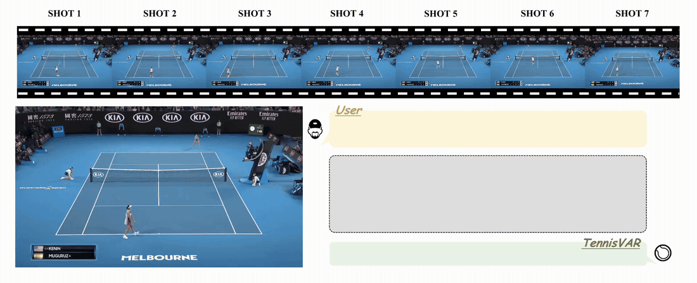
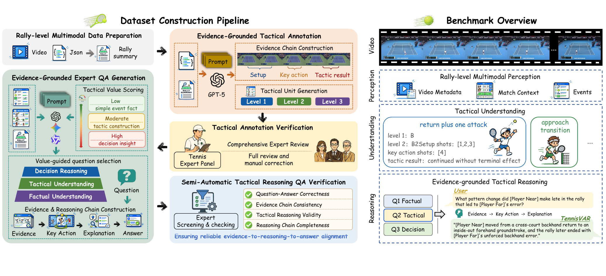
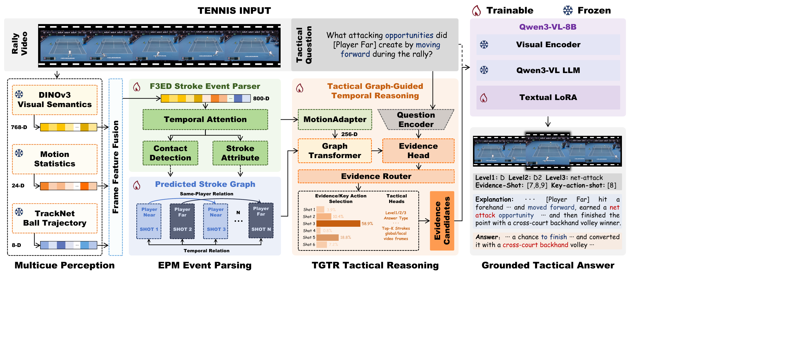
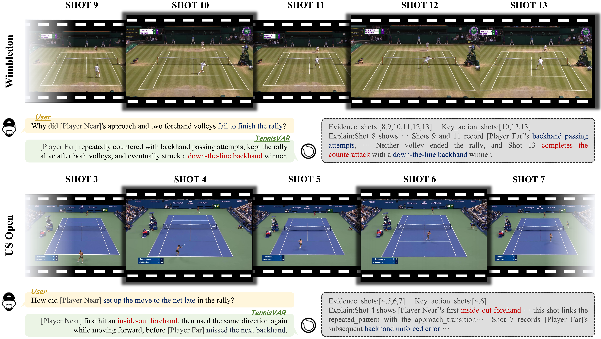

<h1 align="center">🎾 TennisVAR</h1>

<h3 align="center">Stroke-Evidence-Grounded Tactical Reasoning for Tennis Videos</h3>

<p align="center">
  <a href="https://scholar.google.com/citations?user=QJSp3NUAAAAJ">Yifan Mei</a><sup>1</sup>,
  Qingling Shi<sup>1</sup>,
  <a href="https://scholar.google.com/citations?user=K13qHZoAAAAJ">Changli Wu</a><sup>1,2,†</sup>,
  <a href="https://scholar.google.com/citations?user=oW6qV1oAAAAJ">Jiayuan Rao</a><sup>3</sup>,
  <a href="https://scholar.google.com/citations?user=xp_rICcAAAAJ">Jiayi Ji</a><sup>1</sup>,
  <a href="https://scholar.google.com/citations?user=iYEcVaAAAAAJ">Liujuan Cao</a><sup>1,*</sup>
</p>

<p align="center">
  <sup>1</sup> Xiamen University &nbsp; · &nbsp;
  <sup>2</sup> Shanghai Innovation Institute &nbsp; · &nbsp;
  <sup>3</sup> Shanghai Jiao Tong University
  <br>
  <sup>†</sup> Project leader &nbsp; · &nbsp; <sup>*</sup> Corresponding author
</p>

<p align="center">
  <a href="https://whynotgit2025.github.io/TennisVAR/"></a>
  <a href="https://arxiv.org/abs/2608.12920"></a>
  
  
</p>


## 🎬 TennisVAR in Action

<p align="center">
  
</p>

Given a rally and a tactical question, TennisVAR traces the relevant stroke sequence, identifies decisive actions, and produces an evidence-grounded answer. Its reasoning follows a clear path:

<p align="center"><b>Event → Relation → Evidence → Tactic</b></p>

## 📰 News

- **[2026.08]** 🎉 Core model code and training interfaces are released.
- **[2026.08]** 📄 The TennisVAR preprint is available on [arXiv](https://arxiv.org/abs/2608.12920).
- **Coming next:** TRACE access instructions and pretrained checkpoints.

## ✨ Highlights

- **Contact-grounded perception:** every evidence stroke is anchored to its racket-ball contact frame.
- **Action-chain reasoning:** temporal progression and same-player decisions are modeled jointly.
- **Question-aware evidence:** the Evidence Router retrieves supporting strokes and key actions.
- **Grounded generation:** Qwen3-VL answers from sparse global context, local evidence windows, and predicted events.

## 🧩 TRACE Benchmark

<p align="center">
  
</p>

**TRACE** (Tactical Reasoning with Action-Chain Evidence in Tennis) contains **11,189 rally videos**, **41,485 stroke events**, **25,429 tactical units**, and **11,189 evidence-grounded question-answer pairs**. It connects fine-grained stroke perception with factual, tactical, and decision-level reasoning.

> Tennis broadcasts may be controlled by third-party rights holders. We are evaluating a research-friendly TRACE release procedure that does not redistribute protected footage.

## 🏗️ Method

<p align="center">
  
</p>

TennisVAR combines three core components:

1. **Region Motion Event Detector** converts a continuous rally into explicit hit and bounce events.
2. **Tactical Graph-Guided Temporal Reasoner (TGTR)** models temporal and same-player relations.
3. **Qwen3-VL Generator** turns routed visual evidence and predicted events into a grounded tactical answer.

The current TGTR structure, region-motion event detector, preceding fixes, and research rationale are documented in
[`docs/algorithm.md`](docs/algorithm.md). It is an algorithm design update; no reproduced training result is claimed.

## 📊 Results

<p align="center">
  
</p>

TennisVAR produces structured evidence chains together with open-ended tactical explanations, making its answers easier to inspect than ungrounded video-language generation.

## 🚀 Get Started

**Requirements:** Python ≥ 3.10, PyTorch ≥ 2.1, and CUDA for Qwen3-VL LoRA training.

```bash
git clone https://github.com/ZSHYC/TennisVAR.git
cd TennisVAR

python -m venv .venv
source .venv/bin/activate
python -m pip install --upgrade pip
python -m pip install -e '.[train,generation,video]'

cp configs/paths.example.yaml configs/paths.local.yaml
```

Update `configs/paths.local.yaml` with your local DINOv3, Qwen3-VL, data, and artifact paths.

### Inference

The inference interface is ready. Region expert, TGTR, and LoRA checkpoints are separate research artifacts.

```bash
tennisvar predict \
  --video /path/to/rally.mp4 \
  --ball-track /path/to/trajectory.json \
  --event-checkpoint /path/to/region-experts/ \
  --tgtr-checkpoint /path/to/tgtr.pt \
  --qwen-model /path/to/Qwen3-VL-8B-Instruct \
  --question "How did the player create the winning opportunity?" \
  --output result.json
```

The event checkpoint accepts a `tennis-region-infer` expert directory containing
`trajectory_expert.pt` and `visual_expert.pt`. The directory is the only event
detector backend; TGTR and Qwen3-VL training remain separate stages.

```bash
PYTHONPATH=src python scripts/train_tgtr.py \
  --experiment-config configs/tennisvar.yaml

PYTHONPATH=src torchrun --nproc-per-node=8 scripts/train_qwen_lora.py \
  --model /path/to/Qwen3-VL-8B-Instruct \
  --train-data /path/to/train.jsonl \
  --val-data /path/to/val.jsonl \
  --output-dir runs/qwen_lora \
  --report outputs/qwen_lora.json
```

`tennisvar export-events --checkpoint /path/to/region-experts --split train`
exports graphs and hit features for TGTR using the configured frame and TrackNet
roots. Repeat for validation; TrackNet files are `<root>/<split>/<rally>.json`
or `.csv`. These commands are usage instructions, not reproduced results.

## 📦 Release Status

| Component | Status |
| --- | --- |
| Paper and project page | ✅ Available |
| Region event detector, TGTR and generation code | ✅ Available |
| TRACE annotations and split metadata | 🔍 Release plan under review |
| Tennis broadcast videos | ⛔ Not distributed |
| Pretrained region experts, TGTR and LoRA weights | ⏳ Coming soon |

## 🗂️ Repository Layout

```text
configs/                 Paper-aligned configuration
scripts/                 TGTR and Qwen3-VL training entry points
src/tennisvar/           Region event, TGTR and generation code
tests/                    Lightweight unit tests
docs/                     Project website and visual assets
```

## 📝 Citation

```bibtex
@article{mei2026tennisvar,
  title   = {TennisVAR: A Stroke-Evidence-Grounded Multimodal Large Language Model for Tactical Reasoning in Tennis Videos},
  author  = {Mei, Yifan and Shi, Qingling and Wu, Changli and Rao, Jiayuan and Ji, Jiayi and Cao, Liujuan},
  journal = {arXiv preprint arXiv:2608.12920},
  year    = {2026}
}
```

## ✅ TODO

- [x] Release the paper and project page
- [x] Release the core implementation
- [ ] Release pretrained checkpoints
- [ ] Announce the TRACE access procedure
